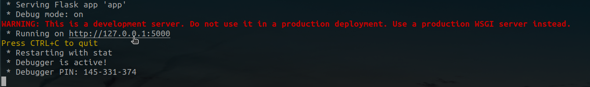
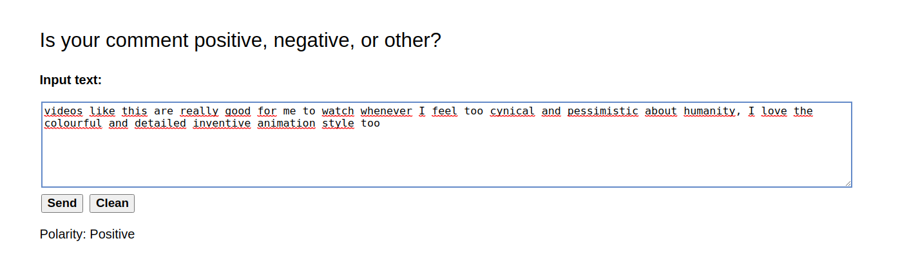
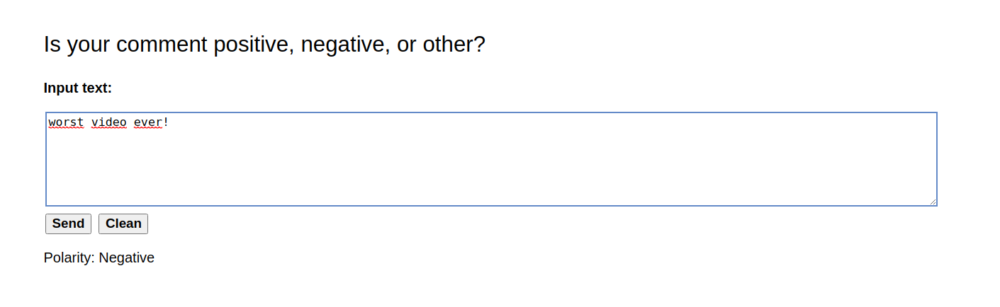

# Sentiment Analysis Project

This repository contains notebooks/scripts for a sentiment analysis project. The project aims to analyze the sentiment of comments from the Youtube channel of **kurzgesagt**.

## **Getting started**

### **Content**

 The project in this repository is organized as follows:

0. **_Data Base Creation_**

    *00_PostgresDataBaseCreate.sh* is a bash script used to create a relational data base (using postgres) and tables to storage the comments retrieved from several videos on the respective channel of interest. You can run it as follows:

        bash 00_PostgresDataBaseCreate.sh -h myhost -U myuser

    Remember replace \<myhost\> and \<myuser\> with the respectives values.

 

1. **_Extract, Transform and Load (ETL)_**

    *01_ETLYoutubeComments.ipynb* focuses on retrieving comments using the YouTube API key (YouTube v3) from 7 specific videos of **kurzgesagt**. Additionally, it performs basic cleaning steps, such as removing HTML tags or emojis. The data is then transformed into a suitable format to be loaded into the database created in step 0.

    Finally, a validation step is performed to ensure that the data does not violate any restrictions defined in the tables in Postgres.

 

2. **_Exploratory Data Analysis (EDA)_**

    In 02_EDA.ipynb, an exploration is conducted to identify the most repeated words, analyze comment length, examine popular comments and users, and explore other aspects of the **kurzgesagt** comments. Additionally, similar explorations are performed on labeled data from YouTube comments and Twitter, retrieved from Kaggle.

    To conclude, all data is meticulously cleaned and lemmatized in preparation for the next step: sentiment analysis.

 

3. **_Sentiment Analysis_**

    The model definition and training are defined here, *03_SentimentAnalysis.ipynb*. Several models were trained using TF-IDF vectorization of the data, experimenting with several features selected by using chi2.

    Models were evaluated in terms of f1-score, precision, recall, and accuracy, as well as the time taken to train and predict in the dataset. The best model chosen was saved and serialized using joblib to be ready for use.

 

4. **_EDA kurgzgesagt_**

    *04_PolarityCommentsKurz.ipynb* presents a brief EDA, showing the most common words and class distribution of the comments retrieved from 7 chosen videos from **Kurzgesagt**.
    
    Additionally, it displays the most important words learned for the classifier in Step 3.

 

5. **_Deployment_**

    *05_Deployment* is the final section of this project. Here, a simple web page is created to enable polarity prediction of text supplied by the user using the models trained in Step 3.

    This folder consists of two main sections: the HTML of the web page and the Python code to execute the prediction.

 

### **Requirements**

An *environment.yml* file is provided to enable running the simple web page created locally. It's worth noting that this file does not take into account libraries or other tools used across this project.

To install the environment using conda, you can run the following code:

    conda env create -f environment.yml

And activate the environment as:

    conda activate sentiment_env

Additionally, you will need to download the folder *05_Deployment* and then uncompress the file **models.zip**. Here are the trained models.

 

### **Deployment**

To launch the web page, run the following code that you will find in the downloaded folder 05_Deployment:

    python app.py

You should look at the terminal for something like this:

Click on the link to go to the web page, and that's it! Now, simply enter your message and click the 'Send' button.

 

